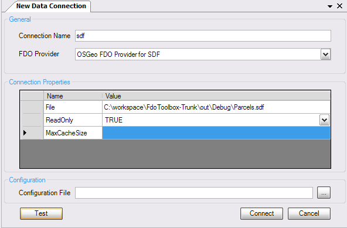

Connecting to Data
==================

.. index::
   single: Connecting to Data; Generic

Using the Generic Dialog
------------------------

.. note::

    Only use the generic connection dialog when a specialized connection option does not exist. Specialized connection options are much faster methods of establishing FDO connections

The generic dialog is a "one size fits all" approach to connecting to a data source. The generic dialog can connect to any FDO provider.

To connect, enter a name for this connection and select a provider from the :guilabel:`Provider` combo box.

When selected, the property grid will be initialized with the required parameters. Enter the required parameters and click :guilabel:`Connect` to
create a new connection. You can click :guilabel:`Test` beforehand to ensure the connection is a valid one.

When the connection is created, a new connection object is visible in the **Object Explorer**

The Express Add-In offers specialized methods of creating connections to particular data sources. It is recommended to use the Express method since the Generic option serves as a 
fallback method for providers without a specialized connection method see :ref:`connect-express`

.. index::
   single: Connections; Save connection
   single: Connections; Load connection

Saving/Loading connections
--------------------------

Connections can be saved and loaded between sessions, which is really useful when working with specific data sources very frequently. To save 
a connection, right click the connection object in the :guilabel:`Object Explorer` and choose :guilabel:`Save Connection`

Connections can be loaded by right clicking the :guilabel:`FDO Data Sources` node in the :guilabel:`Object Explorer` and choosing :guilabel:`Load Connection`

When you shut down FDO Toolbox, any open connections are automatically saved and are recreated when you next run FDO Toolbox.

Connection Configuration
------------------------

For providers that support configuration, you can supply an additional configuration file as part of creating the connection. This configuration file
contains Schema Mapping and Override information for that particular connection. For example, a non-Feature class can be configured into a (point) Feature Class
by specify the X, Y, Z columns of the non-Feature Class.