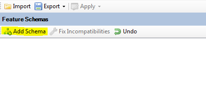
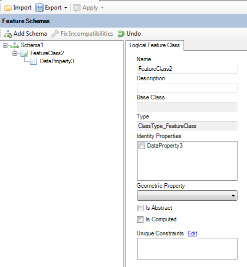
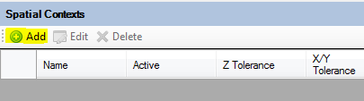
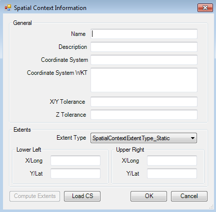

Data Store Management
=====================

.. index::
   single: Data Store Editor

.. _datastore-editor:

The Data Store Editor
---------------------

The Data Store Editor is a unified editor for editing all aspects of a FDO data store:

 * The Logical Feature Schemas
 * The Spatial Contexts

In addition to editing aspects of a data store, the Data Store Editor also allows you to import existing 
schema XML documents or configuration documents into the current data store. In addition the editor also 
allows you to export Feature Schemas to XML or the entire data store as a XML configuration document.

No changes in the data store are applied until you click the Apply Changes command in the editor toolbar.

.. index::
   single: Schema Management; Adding a new schema

Adding a new Feature Schema
---------------------------

To add a new Feature Schema, click the Add Schema button on the Data Store Editor toolbar.

.. note::

    Most providers will only support at most one Feature Schema in the data store

.. index::
   single: Schema Management; Creating New Classes

Adding a new Class Definition
-----------------------------

To add new Class Definitions to a Feature Schema, sleect the desired feature schema and choose the type
of Class Definition you want to add

.. image:: content/dse_addclass.png

A Feature Schema is required in order to add a new Class Definition.

.. index::
   single: Schema Management; Adding class properties

Adding properties to a Class Definition
---------------------------------------

To add new properties to a class definition, select the desired class definition and choose the type
of property you want to add

.. image:: content/dse_addproperty.png

A Class Definition is required in order to add a new Property Definition.

There are 4 different types of properties you can add:

 * Data Properties, for storing data values
 * Geometric Properties, for storing geometry values
 * Association Properties, which defines a relation to another Class Definition (like a foreign key)
 * Object Properties, which allows storage of features

Support for these property types varies from provider to provider, and based on the capabilities of the 
data store you are editing, the context menu will be updated appropriately to ensure you cannot add 
un-supported property definitions. No such restrictions exist in Standalone mode.

.. index::
   single: Schema Management; Updating class properties

Updating a Property Definition
------------------------------

To update a Property Definition, select the desired property. The UI to edit the attributes of this
Property Definition will be loaded.

.. image:: content/dse_addproperty.png

Different UIs will be loaded based on the type of property definition selected.

.. note::

    Some providers may not support modification of Property Definitions

.. index::
   single: Schema Management; Removing class properties

Removing properties from a Class
--------------------------------

To delete a property from a Class Definition, right click the desired property and choose Delete.

.. image:: content/dse_addproperty.png

.. note::

    Some providers may not support deleting of property definitions if they already existed in the data store
    as you opened it through this editor. Some properties can only be deleted if there are no features in the
    feature class.

.. index::
   single: Schema Management; Updating Existing Classes

Updating an Existing Class Definition
-------------------------------------

To edit a class definition, select the desired class definition. The UI to edit the attributes of this Class
Definition will be loaded

.. note::

    Some providers may not support modification of Class Definitions

.. index::
   single: Schema Management; Provider Support

.. _create-assign-spatial-contexts:

Creating and Assigning Spatial Contexts
---------------------------------------

To create a new spatial context, click the **Add** button on the **Spatial Contexts** toolbar

This will bring up the Spatial Context dialog, enter the details of the spatial context to be created

Click **OK** to add the spatial context

.. note::

    Some providers only support a single spatial context.

.. _update-spatial-contexts:

Updating Spatial Contexts
-------------------------

To edit an existing spatial context, select an existing spatial context from the list and click the **Edit** button
on the **Spatial Contexts** toolbar

This will bring up the same Spatial Context dialog, modify the details of the spatial context. Click **OK** to update 
the selected spatial context

.. note::

    Some providers do not support updates of Spatial Contexts

Applying Data Store Changes
---------------------------

Once you have made your Feature Schema and spatial context modifications you can apply the changes back to the data store to 
save the changes.

.. image:: content/dse_applychanges.png

The Apply menu offers you various levels of granularity of changes to apply:

 * **Selected Feature Schema** - Only the selected Feature Schema will be applied to the data store. If this is a newly added schema, it will be created on the data store, otherwise it will be updated
 * **All Feature Schema** - Same as the **Selected Feature Schema** option, except that it applies to all of the Feature Schemas in the editor
 * **Spatial Contexts** - Only the spatial contexts will be applied to the data store, newly added spatial contexts will be created in the data store, existing spatial contexts will be updated
 * **Everything** - All of the above changes will be applied.

.. note::

    Generally, providers better support **creation** of schema elements and spatial contexts rather than updating. Therefore it is generally recommended
    to the big design of the data store up-front, instead of applying feature schema and spatial context changes in an incremental fashion.
