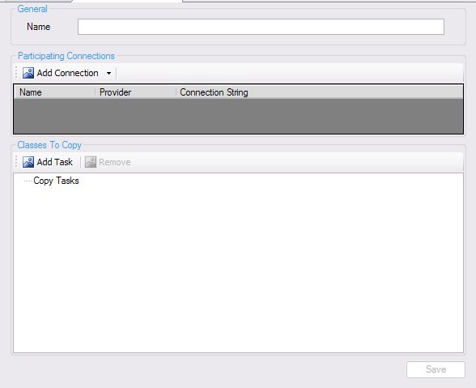
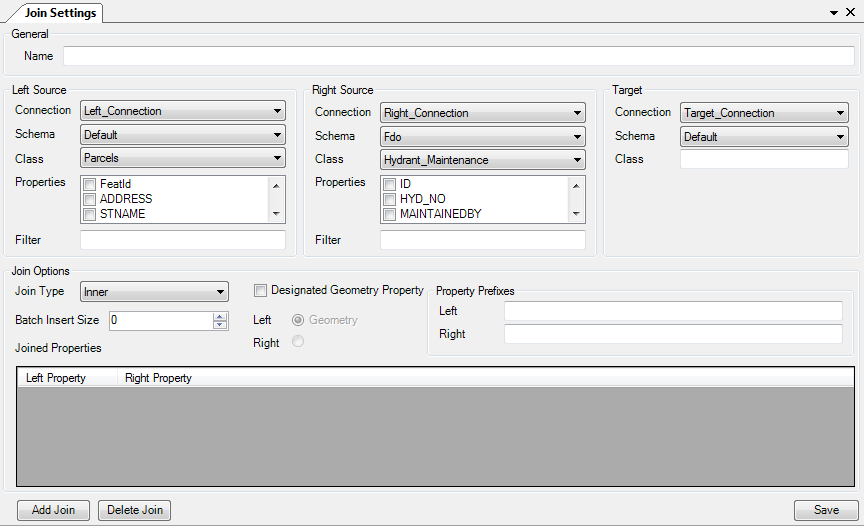

Extract, Transform, Load (ETL) operations
=========================================

There are two main methods of transforming data in FDO Toolbox. They are explained in more detail below

.. index::
   single: Bulk Copy

Bulk Copy
---------

Bulk copy is the first form of data transformation in FDO Toolbox. A bulk copy has the following properties:

 * It involves 1 or more participating connections
 * It contains 1 or more copy tasks.
   * Each copy tasks specifies a series of rules for copying data from [one feature class] in [a participating connection] to [another feature class] in [another participating connection].

To create a new Bulk Copy task, click the :guilabel:`Tasks` node in the **Object Explorer** and choose :guilabel:`New Task` - :guilabel:`Create Bulk Copy`, you will be presented with the following interface:

Then perform the following tasks:

 1. Add the connections that will be participating in this bulk copy operation
 2. Add any number of tasks. For each task.
 
   * Specify the `source feature class` and `target feature class`
   * Map the source properties to their target properties. Optionally configure the data conversion rules for this mapping
   * Optionally, define computed columns with FDO expressions and map them to any target property. Optionally configure the data conversion rules for this mapping.
   * Optionally, configure the options for this particular copy task.
  
 3. Save the task
 
Once saved, a new node will be visible under :guilabel:`Tasks` in the **Object Explorer**, you can right click that node to:

 * Execute the task
 * Save the task
 * Edit the task
 
Saving the task will create an XML file that describes the bulk copy operation. This saved task can be run from the command-line using `FdoUtil.exe` with the `RunTask` command.

If you load a saved task, it will automatically load any participating connections in the Object Explorer if they don't already exist.

SQL Server Notes
^^^^^^^^^^^^^^^^

If bulk copying to SQL Server, FDO Toolbox will auto-correct ring orientation of any input polygon geometries to match the expected ring orientation in SQL Server.

SQL Server may fail in the pre-bulk-copy setup step if it needs to create a spatial context whose coordinate system WKT does not resolve to a known coordinate system in SQL Server's ``sys.spatial_reference_systems`` view. To avoid this problem, you can:

 * Set the **Use Target Spatial Context** option to instruct the bulk copy to not create a spatial context (for the purpose of associating to any feature classes to create), but rather use an existing spatial context on the target connection instead.
 * Or, use the **spatial context override** option to nominate a replacement Coordinate System Name / WKT instead.

Join Operation
==============

Joins are the second form of data transformation in FDO Toolbox. A join has the following properties:

 * A ``left`` FDO connection including the schema, class, property list and optional filter
 * A ``right`` FDO connection including the schema, class, property list and optional filter
 * A ``target`` FDO connection including the schema and the merged class to create. You cannot pick a name for a class that already exists.

To create a new Bulk Copy task, click the :guilabel:`Tasks` node in the **Object Explorer** and choose :guilabel:`New Task` - :guilabel:`Create Join`, you will be presented with the following interface:

Then perform the following tasks:

 1. Set the details of the ``left`` source
 2. Set the details of the ``right`` source
 3. Set the ``target`` destination and enter the name of the merged feature class where the combined left and right sources will be copied into. This must be a name of a class **that does not already exist**
 4. Specify the join settings
    * Of particular note, if you picked properties with the same name on both left and right sides, you will need to specify a **Property Prefix** on either the left or right side to make sure the merged class will not conflict on this particular property, ensuring all properties in this class are uniquely named.
 5. Save the task and then execute it